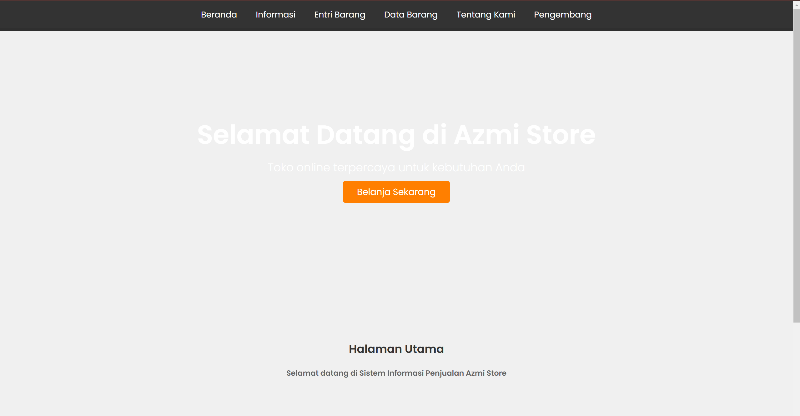

# **Desain Toko Penjualan Laptop**

Desain antarmuka pengguna (UI) untuk **toko penjualan laptop** yang responsif dan modern. Proyek ini menyediakan desain lengkap untuk halaman utama, kategori produk, halaman detail produk, dan halaman kontak. Dengan fokus pada pengalaman pengguna yang ramah dan navigasi yang mudah, desain ini ideal untuk digunakan oleh toko online yang menjual laptop.

## **Fitur Utama**
- **Desain Responsif**: Toko dapat diakses dengan baik di berbagai perangkat, baik desktop, tablet, maupun smartphone.
- **Grid Produk**: Tampilkan laptop dengan gambar, harga, dan deskripsi produk dalam layout grid yang mudah dinavigasi.
- **Navigasi Sederhana**: Menu navigasi yang jelas dan mudah diakses, memungkinkan pengguna dengan mudah berpindah antar halaman.
- **Halaman Hero**: Menampilkan banner besar dengan produk unggulan atau promo khusus, lengkap dengan tombol ajakan bertindak (CTA).
- **Halaman Detail Produk**: Informasi lengkap tentang laptop yang ditawarkan, termasuk spesifikasi dan harga.
- **Fitur Pencarian**: Pengguna dapat mencari produk berdasarkan kategori atau model.
- **Efek Animasi**: Efek hover dan transisi yang membuat pengalaman pengguna lebih dinamis dan menyenangkan.
- **Formulir Kontak**: Memudahkan pengunjung untuk menghubungi toko.

## **Struktur Proyek**

## Tampilan

